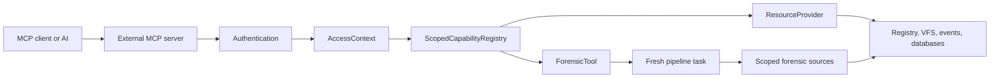
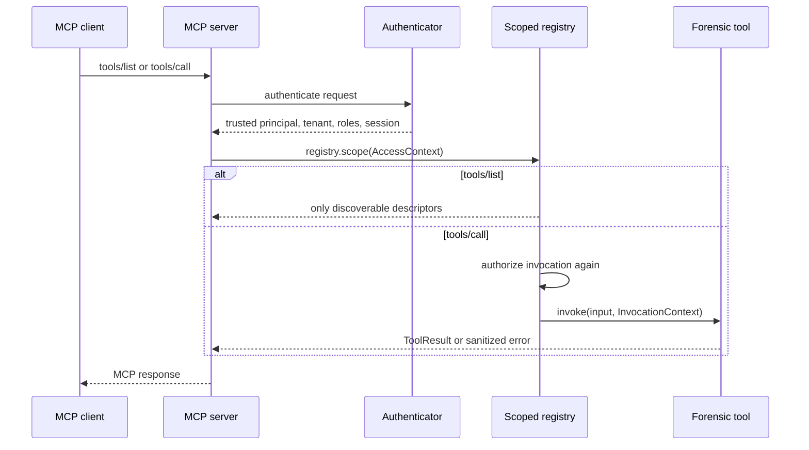
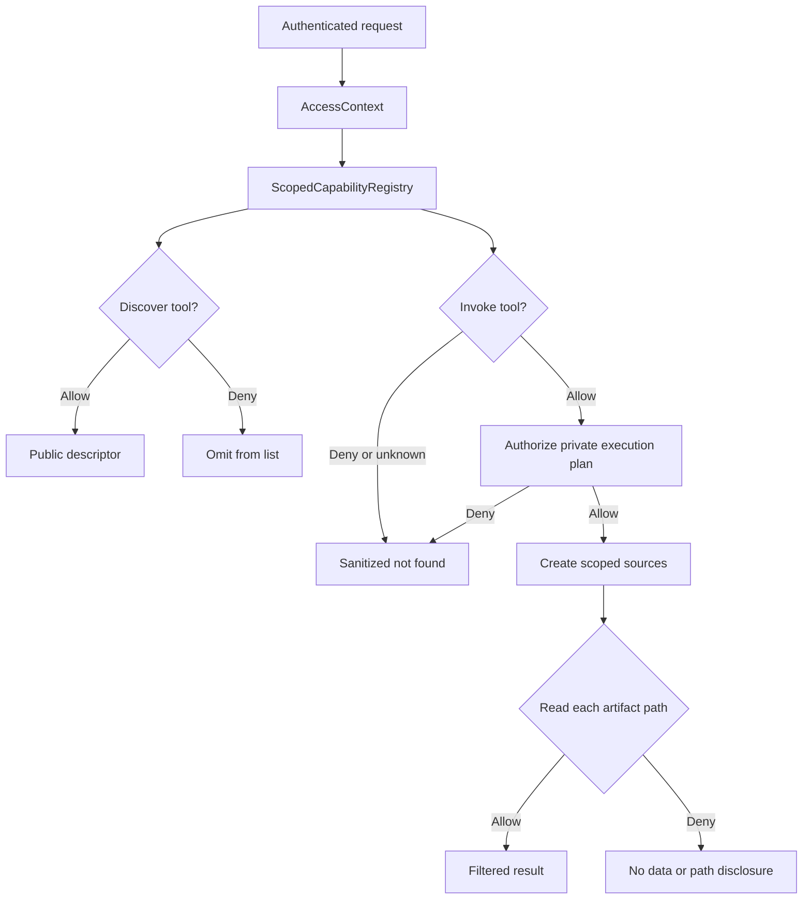

# MCP Integration Plan

## Purpose

This document defines how forensic-rs will expose forensic capabilities to an
external [Model Context Protocol](https://modelcontextprotocol.io/) server
without adding an MCP SDK, JSON-RPC transport, asynchronous runtime, or
authentication implementation to the core crate.

The core owns capability description, authorization enforcement, structured
values, cancellation, and execution. The external MCP server owns transport,
authentication, URI encoding, request IDs, and conversion to MCP messages.

## Status

The initial capability foundation is implemented:

- `AccessContext`, `AccessPolicy`, `AuditedAccessPolicy`, and audit sinks
- `CapabilityValue`, which keeps timestamps and bytes explicit
- `ForensicTool`, descriptors, invocation context, results, and errors
- `CapabilityRegistry` and `ScopedCapabilityRegistry`
- Native `ValueSchema` / `ObjectSchema` input and structured-output validation
- Monotonic `ProgressReporter` updates emitted through `InvocationContext`
- `ResourceProvider`, caller-scoped provider discovery, filtered listing,
  authorized reads, metadata, and core offset pagination
- Hidden tool IDs omitted from discovery and indistinguishable from missing
  IDs during invocation

`VfsProvider`, `RegistryProvider`, `EventLogProvider`, and `DatabaseProvider`
now implement `ResourceProvider` directly while preserving their bridge APIs
and virtual-hook behavior. `BridgeResourceProvider` remains available as a
compatibility adapter for external legacy `ForensicProvider` implementations.
Parser/analyzer factories and scoped sources are the next implementation
phases.

## Design Principles

1. **Protocol-neutral core**: no MCP, JSON-RPC, HTTP, Tokio, or authentication
   dependency in forensic-rs.
2. **Fail closed**: a server-facing registry requires an explicit policy. A
   deployment must opt in to `AllowAllPolicy` only for trusted local use.
3. **No capability disclosure**: a caller can discover only the capabilities
   it may use. Denied and unknown identifiers have the same public result.
4. **Least-privilege evidence access**: an allowed tool may use only the
   parsers, analyzers, artifacts, sources, and paths its execution plan grants.
5. **Fresh analysis state**: analyzer-backed tools create a new pipeline task
   per invocation. Stateful `Analyzer` values are never shared across callers.
6. **Lossless forensic data**: timestamps, bytes, signed/unsigned numbers, and
   ordered objects remain typed until the adapter serializes them.

## Architecture



The MCP server must authenticate a request before it constructs
`AccessContext`. Tool arguments, resource URIs, and client-supplied metadata
must never select the principal, tenant, roles, or session.

## Core Contracts

### Access Context and Policy

`AccessContext` contains a trusted principal, tenant, optional session, roles,
and server-issued metadata. The core receives it after authentication.

`AccessPolicy` evaluates an `AccessRequest` for an `AccessContext`. Requests
cover discovery and invocation of tools, resource providers, parsers,
analyzers, enrichers, sources, artifact instances, and provider-specific
targets such as registry paths, filesystem paths, event channels, and database
tables.

```rust
pub trait AccessPolicy: Send + Sync {
    fn evaluate(
        &self,
        context: &AccessContext,
        request: &AccessRequest<'_>,
    ) -> AccessDecision;
}
```

Policy implementations return `Deny` when they cannot make a decision. They do
not return caller-visible explanations.

### Trusted Audit Records

Wrap a server policy in `AuditedAccessPolicy` to send each authorization
evaluation to an `AccessAuditSink`. The sink receives an owned
`AccessAuditEvent` with the complete trusted `AccessContext`, access kind,
internal capability ID, optional target, and allow/deny result. This includes
nested source checks when the decorated policy is supplied to pipeline tools or
source guards.

Audit records are internal-only. They do not affect discovery, pagination,
caller-visible errors, or policy results. The sink must therefore write only to
trusted server-side storage or telemetry.

### Capability Values

`CapabilityValue` is the core boundary type for tool inputs, structured output,
and resource metadata:

```rust
pub enum CapabilityValue {
    Null,
    Bool(bool),
    I64(i64),
    U64(u64),
    F64(f64),
    Text(Text),
    Timestamp(ForensicTimestamp),
    Bytes(Vec<u8>),
    Array(Vec<CapabilityValue>),
    Object(BTreeMap<Text, CapabilityValue>),
}
```

With the default `serde` feature, `CapabilityValue`, schemas, descriptors,
tool content, results, progress updates, and capability errors support
lossless serde round trips for adapter-owned wire messages. Disabling default
features keeps the protocol-neutral contracts available without serde.

Adapters still decide the final MCP representation: the recommended mapping is
text for normal strings, base64 for bytes, and a documented ISO-8601
representation for timestamps.

### Schemas and Validation

`ValueSchema` is a native, JSON-Schema-compatible subset that supports scalar
types, arrays, and strict objects. `ObjectSchema` declares properties, required
fields, and whether unknown fields are permitted. It does not require
`serde_json`, so `default-features = false` remains supported.

The scoped registry validates `ToolDescriptor::input_schema` before tool
execution. If `output_schema` is present, the tool must return structured data
that matches it; an implementation mismatch is reported as an internal error
rather than exposing an invalid result to an MCP client.

### Evidence and Reader Factories

`TriageSources` contains evidence containers, not one already-open database or
event-log reader. A parser discovers files through its VFS, duplicates that
authorized filesystem view, and opens each discovered artifact with an
injected `ForensicDbFactory`, `EventLogReaderFactory`, or
`RegistryReaderFactory`.

```rust
let filesystem = sources.vfs().ok_or_else(|| {
    ForensicError::missing_data("chromium", "evidence filesystem is unavailable".into())
})?;
let history = sqlite_factory.open(
    filesystem.duplicate(),
    Path::new("Users/Alice/AppData/Local/Chromium/User Data/Default/History"),
)?;
```

Factories receive an owned VFS view plus the artifact path so implementations
can access companion files such as SQLite `-wal` and `-shm` files. The VFS
remains the authorization anchor; a factory using `AuthorizedVirtualFileSystem`
cannot escape the caller's path grants. `AuthorizedForensicDb` and
`AuthorizedEventLogReader` remain available for optional table, row, or channel
restrictions on the derived reader.

### Tools

`ForensicTool` is an object-safe capability implemented by developers:

```rust
pub trait ForensicTool: Send + Sync {
    fn descriptor(&self) -> &ToolDescriptor;

    fn invoke(
        &self,
        input: CapabilityValue,
        context: &InvocationContext,
    ) -> CapabilityResult<ToolResult>;
}
```

`ToolDescriptor` carries a stable `id`, title, description, input schema,
optional structured-output schema, and behavior hints.

### Progress and Cancellation

`InvocationContext` provides a cooperative `CancellationToken` and
`report_progress(ProgressUpdate)`. Progress updates have a current value, an
optional total, and an optional message. The core rejects updates that do not
increase or exceed their declared total, then forwards valid updates to an
adapter-provided `ProgressReporter`.

MCP adapters can implement `ProgressReporter` to send
`notifications/progress`. The adapter owns request-to-progress-token mapping;
forensic-rs only guarantees that updates are scoped to one invocation and
monotonic.

## User and Server Workflow

### Server Setup

An MCP server registers capabilities once during startup, then creates a
caller-scoped view for each authenticated request.

```rust
use std::sync::Arc;

use forensic_rs::prelude::*;

let policy = Arc::new(MyAccessPolicy::new());
let audit = Arc::new(MyAuditSink::new());
let policy = Arc::new(AuditedAccessPolicy::new(policy, audit));
let mut registry = CapabilityRegistry::new(policy);
registry.register_tool(Arc::new(FindSuspiciousLogons::new()))?;

// Authentication happens in the external MCP server, not forensic-rs.
let access = AccessContext::new("analyst-42", "acme")
    .with_session("server-issued-session")
    .with_role("incident-response");
let scoped = registry.scope(access.clone());

// Map this result to MCP tools/list.
let tools = scoped.list_tools();

// Map this result to MCP tools/call.
let result = scoped.invoke_tool(
    "windows.find_suspicious_logons",
    CapabilityValue::Object(Default::default()),
    InvocationContext::new(access),
)?;
```

### Request Flow



The server must not retain a scoped view across requests unless its identity,
tenant, session, and grants are guaranteed unchanged.

## Creating a Custom Tool

Use a direct `ForensicTool` when the operation does not need the record-based
pipeline. The tool validates untrusted input, checks cancellation during long
work, and returns typed structured output.

```rust
use std::collections::BTreeMap;

use forensic_rs::prelude::*;

struct CaseSummaryTool {
    descriptor: ToolDescriptor,
}

impl CaseSummaryTool {
    fn new() -> Self {
        Self {
            descriptor: ToolDescriptor {
                id: "case.summary".to_string(),
                title: "Case summary".to_string(),
                description: "Returns an authorized forensic case summary.".to_string(),
                input_schema: ValueSchema::object()
                    .property("case_id", ValueSchema::Type(ValueType::Text))
                    .required("case_id")
                    .into(),
                output_schema: Some(
                    ValueSchema::object()
                        .property("case_id", ValueSchema::Type(ValueType::Text))
                        .property("finding_count", ValueSchema::Type(ValueType::Integer))
                        .required("case_id")
                        .required("finding_count")
                        .into(),
                ),
                hints: ToolHints {
                    read_only: true,
                    idempotent: true,
                    ..ToolHints::default()
                },
            },
        }
    }
}

impl ForensicTool for CaseSummaryTool {
    fn descriptor(&self) -> &ToolDescriptor {
        &self.descriptor
    }

    fn invoke(
        &self,
        input: CapabilityValue,
        context: &InvocationContext,
    ) -> CapabilityResult<ToolResult> {
        if context.cancellation.is_cancelled() {
            return Err(CapabilityError::new(
                CapabilityErrorKind::Cancelled,
                "operation cancelled",
            ));
        }

        let Some(fields) = input.as_object() else {
            return Err(CapabilityError::new(
                CapabilityErrorKind::InvalidInput,
                "tool input must be an object",
            ));
        };
        let Some(case_id) = fields.get("case_id").and_then(CapabilityValue::as_text) else {
            return Err(CapabilityError::new(
                CapabilityErrorKind::InvalidInput,
                "case_id is required",
            ));
        };

        let mut summary = BTreeMap::new();
        summary.insert(Text::Borrowed("case_id"), CapabilityValue::from(case_id.to_string()));
        summary.insert(Text::Borrowed("finding_count"), CapabilityValue::from(0u64));
        Ok(ToolResult::structured(CapabilityValue::Object(summary)))
    }
}
```

`AccessRequirements` and `AuthorizedSourceFactory` are implemented for
analyzer-backed registrations. They authorize every declared parser, analyzer,
enricher, artifact, and source before the one-shot source factory is invoked.
A denied requirement returns the same public `NotFound` boundary and the
factory is not called. Requirement IDs never appear in the descriptor, MCP
schema, tool result, or public error.

## Exposing Parsers and Analyzers Safely

`Analyzer` remains a record-oriented pipeline trait. It is not exposed directly
as an MCP tool because it needs parser input, may keep state across records, and
uses `finalize()` after processing completes.

Instead, `PipelineTaskTool` creates a fresh task per invocation through a
developer-provided `PipelineTaskFactory`:

```rust
let tool = PipelineTaskTool::new(
    /* public ToolDescriptor */,
    AccessRequirements::new()
        .parser("windows.evtx")
        .analyzer("windows.event_gap")
        .reader_factory("windows.evtx.reader")
        .virtual_file_system("case-evidence"),
    Arc::new(policy),
    Arc::new(MyEventGapFactory),
);
```

Before the task factory is constructed, `PipelineTaskTool` authorizes the
complete execution plan. Its `AuthorizedPipelineContext` can create an
`AuthorizedSourceFactory` for worker-local sources, which repeats the plan
check immediately before source construction. The plan contains internal IDs
for parsers, analyzers, enrichers, allowed artifact classes or instances, and
data-source grants. The public MCP tool exposes only the final tool descriptor.

This prevents a user or AI from learning that a hidden parser or analyzer
exists, which artifacts it supports, or what source data it could access.

## Authorization and Non-Disclosure

### Enforcement Rules

1. The external server authenticates; it creates trusted `AccessContext`.
2. Only `ScopedCapabilityRegistry` lists or invokes server-facing capabilities.
3. Discovery is filtered before pagination, so hidden tools do not affect IDs,
   counts, cursors, names, descriptions, schemas, or artifact lists.
4. Invocation, resource reads, and nested data access evaluate policy again.
5. Hidden and unknown IDs return the same public `NotFound` error.
6. Policy errors fail closed and do not become an allow decision.
7. Private dependency IDs and authorization requirements never leave core.
8. The implemented source factory authorizes complete execution plans before
    evidence sources are created. `AuthorizedVirtualFileSystem` enforces path
    access before a reader factory opens a derived artifact.
    `AuthorizedEventLogReader` can additionally filter channel discovery,
    queries, counts, and returned records. `AuthorizedForensicDb` can filter
    table discovery, table access, and row cursors by stable
    `table/row-index` targets. It suppresses table row counts and rejects reads
    unless the cursor has exposed an authorized current row.
9. Cached results include tenant and authorization scope in their key.
10. Output resource references are filtered before they are returned.

### Planned Authorization Flow



### What Must Remain Hidden

The following must not be visible to an unauthorized user or AI:

- Tool, parser, analyzer, enricher, and provider identifiers
- Tool descriptions, schemas, titles, field names, and output shapes
- Supported artifact classes and parser/analyzer relationships
- Provider, child, table, channel, hive, file, and path names
- Pagination totals or cursors influenced by denied objects
- Private dependency requirements and failed authorization reasons
- Error messages from parsers or source readers that reveal restricted data
- Cached output produced for another tenant, session, or authorization scope

## Resources

The existing [bridge module](./src/bridge/mod.rs) already exposes a navigable
tree. The protocol-neutral `ResourceProvider: Send + Sync` contract is now
implemented alongside it and will supersede the UI-oriented `ForensicProvider`
contract for new integrations. All built-in VFS, Registry, Event Log, and
Database providers implement the new contract directly.
`BridgeResourceProvider` wraps an existing `Box<dyn ForensicProvider>` with a
resource descriptor, preserving recursive bridge values as `CapabilityValue`
for external providers that have not yet migrated.

It defines:

- `ResourceProviderDescriptor` with public provider metadata
- `ResourceId { provider, path }`
- `ResourceEntry`, `ResourceKind`, `ResourceMetadata`, and `ResourceContent`
- `PageRequest` and `Page<T>` for stable pagination
- Text, binary, and structured content without lossy conversion

Only `ScopedCapabilityRegistry` exposes providers to server-facing callers.
It checks provider discovery, checks parent-path listing access, filters every
child by path access, then calculates the total and page offsets. Consequently,
hidden children do not affect provider lists, entry names, totals, or cursors.
Read and metadata operations authorize the target path again and return the
same public not-found error for hidden providers or resources.

The adapter may map an authorized resource ID to an adapter-owned URI such as
`forensic://{provider}/{percent-encoded-path}`. URI parsing, percent encoding,
and opaque MCP cursors remain external adapter responsibilities.

## MCP Mapping

| Core contract | External MCP adapter responsibility |
| --- | --- |
| `ScopedCapabilityRegistry::list_tools()` | `tools/list` result |
| `ScopedCapabilityRegistry::invoke_tool()` | `tools/call` result |
| `ToolDescriptor` | MCP tool name, title, description, schemas, annotations |
| `CapabilityValue` | JSON structured content, text, base64 bytes, timestamp encoding |
| `ToolResult` | MCP content and `structuredContent` |
| `ResourceProvider` | `resources/list`, templates, and `resources/read` |
| `ResourceId` | Adapter-owned MCP URI |
| `AccessContext` | Constructed from authenticated transport/session state |
| `CancellationToken` | Registered against MCP cancellation notifications |
| `ProgressReporter` | MCP progress notifications |
| `CapabilityErrorKind::NotFound` | Sanitized MCP tool/resource not-found error |

## Implementation Phases

1. **Foundation**: access context/policy, values, tools, scoped tool registry.
   This phase is implemented.
2. **Execution controls**: native schema validation, monotonic progress
    reporting, and trusted access-audit hooks are implemented. Audit events are
    emitted through `AuditedAccessPolicy` without changing public errors.
3. **Provider migration**: VFS, Registry, Event Log, and Database implement
    native resource providers. The bridge compatibility adapter remains for
    external legacy providers. This phase is implemented.
4. **Pipeline tools**: private dependency declarations, scoped parser/analyzer
    factories, least-privilege evidence VFS sources, derived reader factories,
    fresh task factories, and result bounds. Source guards are implemented.
5. **Documentation and release**: README link, changelog, migration notes,
    feature-gated serde conversion, and compatibility tests for capability
    values, schemas, descriptors, and results are implemented.

## Verification

Run the capability-focused tests during implementation:

```powershell
cargo test capabilities
cargo test --all-features
cargo test --no-default-features
cargo fmt --check
cargo clippy --all-targets --all-features -- -D warnings
```

Add adversarial tests for:

- Hidden capabilities omitted before pagination/counting
- Hidden and unknown IDs producing identical public errors
- No schema, dependency, artifact, or path leaks from discovery/errors
- Policy evaluation failure denying access
- Re-authorization after discovery and before execution
- Parser auto-matching never instantiating denied factories
- Scoped sources rejecting denied paths, channels, tables, and artifacts
- Output links filtered to the caller scope
- Concurrent callers and cached results isolated by tenant/session/grants

## How-To Guides

This section provides quick reference for common MCP integration tasks. For
step-by-step tutorials, see the [MCP Server Developer Guide](./docs/mcp-server-guide/).

### Creating Your First Tool

See [Your First Tool](./docs/mcp-server-guide/04_tutorial/02_first_tool.md) for a detailed walkthrough.

```rust
use std::collections::BTreeMap;
use forensic_rs::field::Text;
use forensic_rs::prelude::*;

struct MyTool {
    descriptor: ToolDescriptor,
}

impl MyTool {
    fn new() -> Self {
        Self {
            descriptor: ToolDescriptor {
                id: "my.tool".into(),
                title: "My Tool".into(),
                description: "Does something useful.".into(),
                input_schema: ValueSchema::object()
                    .property("input", ValueSchema::Type(ValueType::Text))
                    .required("input")
                    .into(),
                output_schema: Some(
                    ValueSchema::object()
                        .property("result", ValueSchema::Type(ValueType::Text))
                        .required("result")
                        .into()
                ),
                hints: ToolHints::default(),
            },
        }
    }
}

impl ForensicTool for MyTool {
    fn descriptor(&self) -> &ToolDescriptor { &self.descriptor }

    fn invoke(&self, input: CapabilityValue, _context: &InvocationContext) -> CapabilityResult<ToolResult> {
        let fields = input.as_object().ok_or_else(||
            CapabilityError::new(CapabilityErrorKind::InvalidInput, "input must be an object")
        )?;
        let text = fields.get("input").and_then(CapabilityValue::as_text)
            .ok_or_else(|| CapabilityError::new(CapabilityErrorKind::InvalidInput, "input required"))?;

        let mut result = BTreeMap::new();
        result.insert(Text::Borrowed("result"), CapabilityValue::from(format!("processed: {}", text)));

        Ok(ToolResult::structured(CapabilityValue::Object(result)))
    }
}
```

### Registering Tools with the Registry

```rust
let policy = Arc::new(AllowAllPolicy::new());
let mut registry = CapabilityRegistry::new(policy);
registry.register_tool(Arc::new(MyTool::new())).unwrap();

// Create scoped view for a request
let access = AccessContext::new("analyst-42", "acme")
    .with_role("analyst");
let scoped = registry.scope(access);

// List and invoke tools
for tool in scoped.list_tools() {
    println!("Tool: {} - {}", tool.id, tool.title);
}
```

### Handling Progress and Cancellation

See [Progress Reporting Cookbook](./docs/mcp-server-guide/05_cookbook/tools.md#recipe-5-long-running-tool-with-progress) for more patterns.

```rust
impl ForensicTool for LongRunningTool {
    fn invoke(&self, input: CapabilityValue, context: &InvocationContext) -> CapabilityResult<ToolResult> {
        let total = 100u64;

        for i in 0..total {
            // Check cancellation BEFORE each iteration
            if context.cancellation.is_cancelled() {
                return Err(CapabilityError::new(CapabilityErrorKind::Cancelled, "cancelled"));
            }

            // Report progress
            context.report_progress(
                ProgressUpdate::new(i + 1)
                    .with_total(total)
                    .with_message(format!("Processing {}/{}", i + 1, total))
            ).ok();  // Don't abort on reporter errors

            do_work(i)?;
        }

        Ok(ToolResult::structured(...))
    }
}
```

### Implementing Access Control

See [Access Control Tutorial](./docs/mcp-server-guide/04_tutorial/07_access_control.md) for detailed patterns.

```rust
use forensic_rs::prelude::*;

struct RbacPolicy {
    // Role -> allowed tool IDs
    permissions: BTreeMap<Text, Vec<Text>>,
}

impl AccessPolicy for RbacPolicy {
    fn evaluate(&self, context: &AccessContext, request: &AccessRequest<'_>) -> AccessDecision {
        let tool_id = match request {
            AccessRequest::InvokeTool { tool_id } => tool_id,
            AccessRequest::DiscoverTool { tool_id } => tool_id,
            _ => return AccessDecision::Allow,
        };

        for role in &context.roles {
            if let Some(allowed) = self.permissions.get(role) {
                if allowed.iter().any(|p| p == tool_id || p == "*") {
                    return AccessDecision::Allow;
                }
            }
        }
        AccessDecision::Deny
    }
}
```

### Mapping to MCP Protocol

See [Architecture Guide](./docs/mcp-server-guide/02_architecture.md) for the complete mapping.

| Core Contract | MCP Method |
|---------------|------------|
| `CapabilityRegistry::list_tools()` | `tools/list` |
| `CapabilityRegistry::scope().list_tools()` | Filtered `tools/list` |
| `ScopedCapabilityRegistry::invoke_tool()` | `tools/call` |
| `CapabilityValue` | JSON structured content |
| `ToolResult::structured()` | `structuredContent` |
| `ProgressUpdate` | `notifications/progress` |
| `CancellationToken` | `notifications/cancelled` |
| `ResourceProvider` | `resources/list`, `resources/read` |

### Exposing Resources

See [Resources Tutorial](./docs/mcp-server-guide/04_tutorial/06_resources.md) for details.

```rust
use forensic_rs::bridge::providers::{RegistryProvider, VfsProvider};

// Create resource providers
let reg_provider = RegistryProvider::new(my_registry);
let vfs_provider = VfsProvider::new(my_vfs);

// Register with capability registry
let mut registry = CapabilityRegistry::new(policy);
registry.register_resource_provider(Arc::new(reg_provider)).unwrap();
registry.register_resource_provider(Arc::new(vfs_provider)).unwrap();
```

## Scope Boundaries

forensic-rs will not implement an MCP server, transport, JSON-RPC types,
authentication mechanism, identity provider, role store, asynchronous runtime,
prompts, sampling, rate limiting, or resource subscriptions in this work.

Those are host concerns. The core begins enforcement only after a host supplies
a trusted `AccessContext`, and it must then prevent unauthorized discovery,
execution, and evidence access.

## Additional Resources

- [MCP Server Developer Guide](./docs/mcp-server-guide/) - Complete tutorial with step-by-step walkthroughs
- [Quickstart](./docs/mcp-server-guide/03_quickstart.md) - Get a working server in 5 minutes
- [Cookbook](./docs/mcp-server-guide/05_cookbook/tools.md) - Reusable code patterns
- [Troubleshooting](./docs/mcp-server-guide/06_troubleshooting.md) - Common issues and solutions