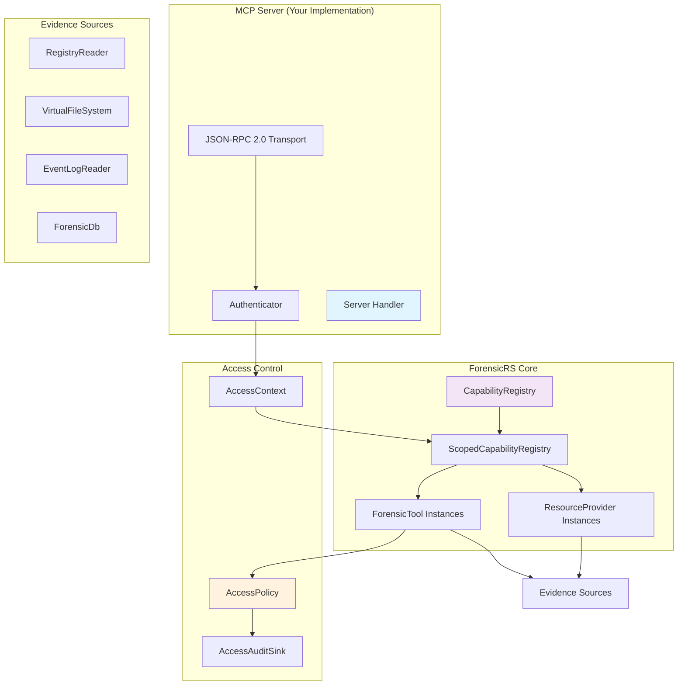
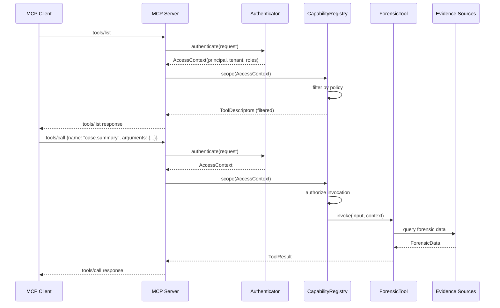

# ForensicRS MCP Architecture

This document provides a detailed architectural overview of how ForensicRS capabilities are exposed through MCP servers.

## Component Architecture



## Request Flow



## Core Components

### CapabilityRegistry

The `CapabilityRegistry` is the central container for all forensic capabilities:

```rust
use forensic_rs::prelude::*;

let policy = Arc::new(MyAccessPolicy::new());
let mut registry = CapabilityRegistry::new(policy);
registry.register_tool(Arc::new(MyTool::new()))?;
```

**Key responsibilities:**
- Register tools and resource providers
- Enforce access policy at discovery time
- Delegate invocation to scoped registry

### ScopedCapabilityRegistry

Created per-request, this provides a filtered view based on the caller's `AccessContext`:

```rust
let access = AccessContext::new("analyst-42", "acme-corp")
    .with_role("incident-responder");

let scoped = registry.scope(access);
let tools = scoped.list_tools();  // Only authorized tools visible
```

### ForensicTool

The `ForensicTool` trait is the primary extension point:

```rust
use forensic_rs::prelude::*;

pub trait ForensicTool: Send + Sync {
    fn descriptor(&self) -> &ToolDescriptor;
    fn invoke(
        &self,
        input: CapabilityValue,
        context: &InvocationContext,
    ) -> CapabilityResult<ToolResult>;
}
```

**Tool lifecycle:**
1. Registry validates caller can discover the tool
2. Registry validates caller can invoke the tool
3. Tool receives typed `CapabilityValue` input
4. Tool uses `InvocationContext` for progress/cancellation
5. Tool returns `ToolResult` with typed `CapabilityValue` output

### InvocationContext

Passed to each tool invocation, `InvocationContext` provides:

```rust
pub struct InvocationContext {
    pub access: AccessContext,
    pub cancellation: CancellationToken,
    // ... internal fields
}

impl InvocationContext {
    pub fn report_progress(&self, update: ProgressUpdate) -> CapabilityResult<()> { ... }
}
```

**Usage pattern:**
```rust
fn invoke(&self, input: CapabilityValue, context: &InvocationContext) -> CapabilityResult<ToolResult> {
    // Check cancellation before expensive operation
    if context.cancellation.is_cancelled() {
        return Err(CapabilityError::new(CapabilityErrorKind::Cancelled, "..."));
    }

    // Report progress during long operation
    context.report_progress(ProgressUpdate::new(5).with_total(10).with_message("Step 2"))?;

    // Do work...
}
```

### AccessPolicy

The `AccessPolicy` trait enforces authorization:

```rust
pub trait AccessPolicy: Send + Sync {
    fn evaluate(
        &self,
        context: &AccessContext,
        request: &AccessRequest<'_>,
    ) -> AccessDecision;
}

pub enum AccessDecision {
    Allow,
    Deny,
}
```

**Built-in policies:**
- `AllowAllPolicy` - Trust any principal (development only)
- `DenyAllPolicy` - Deny all operations
- `AuditedAccessPolicy` - Wraps another policy, logs all decisions

### ResourceProvider

`ResourceProvider` exposes navigable data trees:

```rust
pub trait ResourceProvider: Send + Sync {
    fn descriptor(&self) -> &ResourceProviderDescriptor;
    fn children(&self, path: &str, cancellation: &CancellationToken) -> CapabilityResult<Vec<ResourceEntry>>;
    fn read(&self, path: &str, cancellation: &CancellationToken) -> CapabilityResult<ResourceContent>;
    fn metadata(&self, path: &str, cancellation: &CancellationToken) -> CapabilityResult<ResourceMetadata>;
}
```

**Built-in providers:**
- `RegistryProvider` - Exposes registry hives/keys/values
- `VfsProvider` - Exposes filesystem paths
- `EventLogProvider` - Exposes event channels/records
- `DatabaseProvider` - Exposes database tables/rows

## CapabilityValue Type System

The framework uses a typed value system that survives serialization:

```rust
pub enum CapabilityValue {
    Null,
    Bool(bool),
    I64(i64),
    U64(u64),
    F64(f64),
    Text(Text),
    Timestamp(ForensicTimestamp),
    Bytes(Vec<u8>),
    Array(Vec<CapabilityValue>),
    Object(BTreeMap<Text, CapabilityValue>),
}
```

**Type mappings to MCP JSON:**

| ForensicRS Type | MCP JSON Representation |
|-----------------|------------------------|
| `Null` | `null` |
| `Bool` | `true` / `false` |
| `I64` / `U64` | JSON number |
| `F64` | JSON number |
| `Text` | JSON string |
| `Timestamp` | ISO-8601 string |
| `Bytes` | Base64-encoded string |
| `Array` | JSON array |
| `Object` | JSON object |

## JSON-RPC 2.0 Stdio Transport

MCP over stdio uses newline-delimited JSON-RPC 2.0 messages:

**Request:**
```json
{"jsonrpc": "2.0", "id": 1, "method": "tools/call", "params": {"name": "case.summary", "arguments": {"case_id": "INC-001"}}}
```

**Response:**
```json
{"jsonrpc": "2.0", "id": 1, "result": {"content": [{"type": "text", "text": "..."}], "structuredContent": {...}}}
```

**Error:**
```json
{"jsonrpc": "2.0", "id": 1, "error": {"code": -32602, "message": "Invalid input", "data": {"kind": "InvalidInput"}}}
```

## Security Model

### Defense Layers

1. **Transport authentication** - Your MCP server authenticates callers before constructing `AccessContext`
2. **Capability filtering** - `ScopedCapabilityRegistry` hides unauthorized tools and resources
3. **Invocation authorization** - Each invocation is re-authorized against the policy
4. **Source guards** - Path-level authorization for evidence access

### What Must Remain Hidden

The following never leak to unauthorized callers:
- Tool, parser, analyzer, and provider identifiers
- Schema definitions, field names, output shapes
- Supported artifact classes and parser relationships
- Provider paths, channel names, hive names
- Error messages that would reveal restricted data

## Next Steps

- Continue to [Quickstart](./03_quickstart.md) to build a working server
- See [Tutorial: Your First Tool](../04_tutorial/02_first_tool.md) for implementation
- Review [MCP Integration Design](../../MCP_INTEGRATION.md) for complete specification
